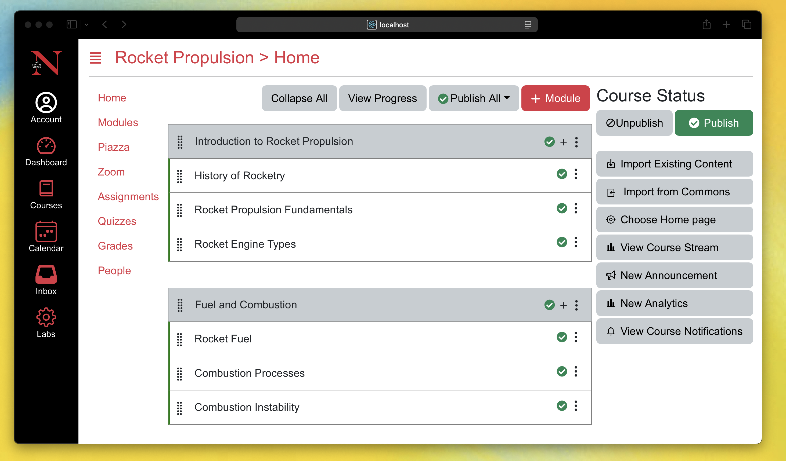
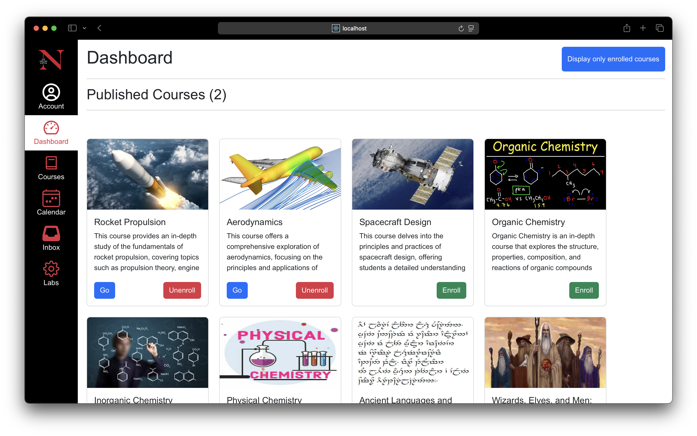
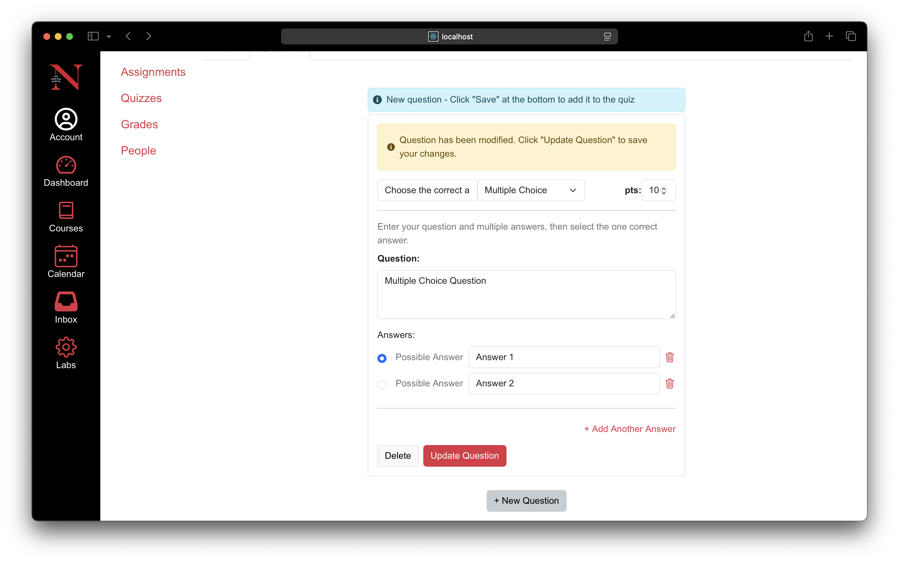
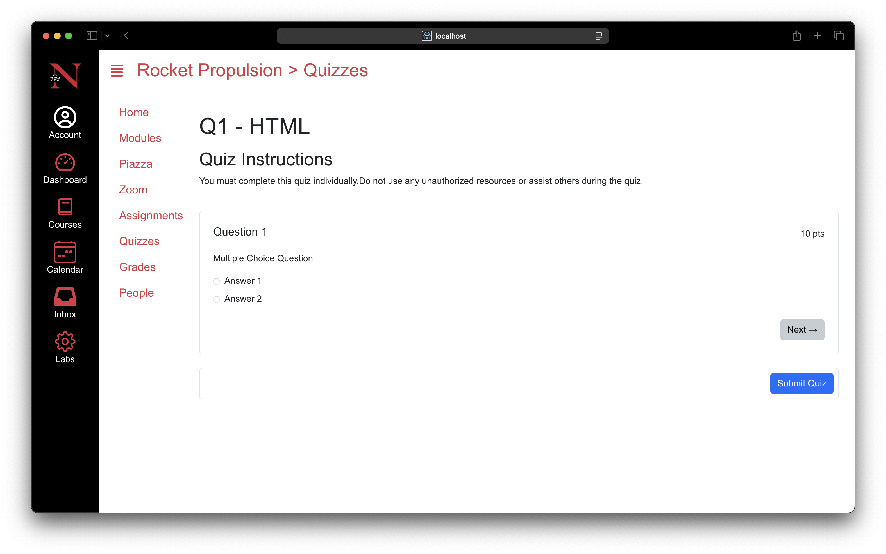
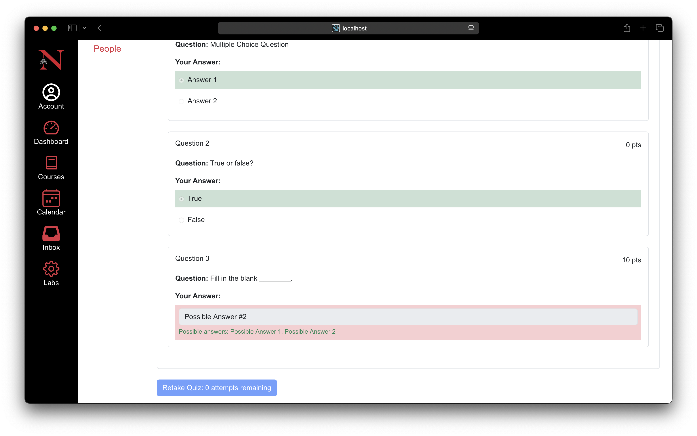

# Kanbas

<p align = "center">
  <a href="https://www.repostatus.org/#inactive">
    
</a>
</p>


Kanbas is a rudimentary version of the widely acclaimed Learning Management System (LMS), Canvas. This full-stack application contains a comprehensive suite of features such as quizzes, courses and assignments. The application is structured around different user roles, such as students and faculty, which dictate the available features, ensuring that users have access to the specific tools they need for their roles. This is the repository for the frontend. This application also needs the backend server to be running in order for it to work. Here's the [link](https://github.com/technophilist/kanbas-node-server-app) to the backend repository.

## Table of contents
1. [Demo](#demo)
2. [Screenshots](#screenshots)
3. [Tech Stack](#tech-stack)
4. [Notable features](#notable-features)
5. [Building and running the app](#building-and-running-the-app)

## Demo
Comming Soon...

## Screenshots






## Tech Stack
- Entirely Written in [TypeScript](https://www.typescriptlang.org/).
- [React Router](https://reactrouter.com) for routing and navigation.
- [Redux](https://redux.js.org) for global state management.
- [Axios](https://axios-http.com/docs/intro) for making HTTP requests.
- [Bootstrap](https://getbootstrap.com) for responsive design and styling.
- [React Icons](https://react-icons.github.io/react-icons/) for icons.

## Notable features

<dl>
  <dt> Role-Based Access Control 🔒 </dt>
  <dd> Each user is granted features tailored to their specific role. For instance, faculty members can add course quizzes, create and edit assignments, while students are limited to joining courses, completing assignments, and taking quizzes. This ensures a streamlined experience for each user group.</dd>
  
  <dt> Visually Appealing User Interface ✨</dt>
  <dd> The application boasts a visually appealing user-friendly interface, leveraging the Bootstrap framework to closely resemble the look and feel of the official Canvas application.</dd>
  
  <dt> Secure Navigation 🚪 </dt>
  <dd> The application implements protected routes, allowing access only to authenticated users. Unauthenticated users attempting to navigate these routes are automatically redirected to the login or signup page, ensuring secure and restricted access to sensitive sections of the app.</dd>
</dl>

## Building and running the app
- Create a ```.local.env``` file in the root of the project and add the following environment variable.
  ```
  REACT_APP_REMOTE_SERVER=the_url_of_the_server. // Eg: REACT_APP_REMOTE_SERVER=http://localhost:4000
  ```
- Execute ```npm install``` to install dependencies.
- Execute ```npm start``` to start the application.
